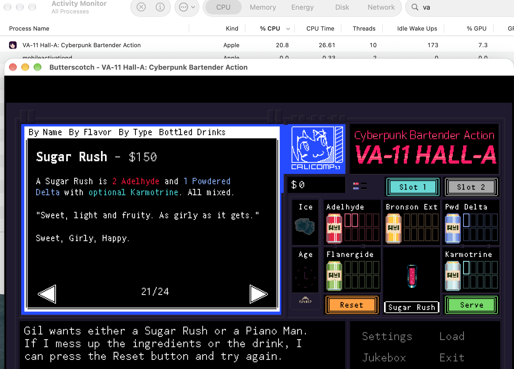

# VA-11 Hall-A macOS 64 位 Runner

[](https://github.com/noahhhi/VA-11-Hall-A-64bit/actions/workflows/build-macos.yml)

<p align="center">
  <a href="README.md">English</a> |
  <a href="README.zh-CN.md">简体中文</a>
</p>

为 macOS Steam 版《VA-11 Hall-A：赛博朋克酒保行动》提供的原生 64 位 runner，基于开源的 GameMaker Studio 1.4 runner [Butterscotch](https://github.com/ButterscotchRunner/Butterscotch) 构建。它替换游戏自带的 32 位 `Mac_Runner`——在 macOS 10.15 Catalina 及以后的系统上无法启动。

当前参考测试环境：Apple Silicon Mac，macOS 27.0，Steam 版 VA-11 Hall-A（AppID 447530，`game.ios` 字节码 v15）。启动、调酒、设置面板（音量 / 扫描线 / 全屏）与存档读写均已通过本机测试。

<p align="center">
  
  <br>
  <em>原生支持 Apple Silicon（arm64）——活动监视器将运行中的游戏识别为“Apple”进程。</em>
</p>

> **说明：** 安装包只包含修复组件。你需要在 Steam 上拥有 VA-11 Hall-A；本仓库不包含也不分发任何游戏。

## 系统要求

- macOS，Apple Silicon（arm64）或 64 位 Intel（x86_64）
- 已通过 Steam 安装 VA-11 Hall-A（默认位置：`~/Library/Application Support/Steam/steamapps/common/VA-11 HALL-A/`）

## 一键安装

从 [GitHub Releases](https://github.com/noahhhi/VA-11-Hall-A-64bit/releases) 下载 `VA-11-Hall-A-64bit-universal.pkg` 并双击。安装包会扫描所有 Steam 库，安装 arm64/x86_64 通用 runner 与 Valve 官方 Steamworks 运行库，更新 app 入口并重新签名，同时在 app 外保留原版 runner 与签名用于恢复。

预览构建仍提供 `.command` 备用流程：解压 `VA-11-Hall-A-64bit-universal.zip`，双击 `Install VA-11 Hall-A 64bit.command`，或运行：

```sh
cd VA-11-Hall-A-64bit-universal
./install.sh
```

安装器会明确报告 macOS 版本不支持、Steam 库缺失、app 包结构异常、组件缺少架构或权限不足等错误，并在安装失败时自动回滚，避免留下错误的安装状态。成功后可照常从 Steam 启动游戏。

> [!IMPORTANT]
> runner 使用 ad-hoc 签名（由 `install.sh` 在你本机完成重签）。如果 macOS 阻止首次启动，打开 **系统设置 → 隐私与安全性**，点击 **仍要打开**。无需关闭 Gatekeeper，也无需降低系统安全性。

如果因安装位置特殊而无法自动定位，可在终端手动传入游戏路径：`./install.sh "/路径/VA-11 Hall-A Cyberpunk Bartender Action.app"`。

## 存档与 Steam 云同步

存档格式与原版兼容，写入 `~/Library/Application Support/VA_11_Hall_A/saves/`。安装器只会迁移目标目录中尚不存在的旧存档，不会覆盖已有进度；从 Steam 启动时，由游戏发行商配置的 AutoCloud 负责上传与下载。

## 卸载

Release ZIP 中包含 `uninstall.sh`，同时也提供独立的 Release 资产。从 ZIP 解压目录运行，或单独下载后运行：

```sh
bash ~/Downloads/uninstall.sh
```

会从安装时创建的备份恢复原版 `Mac_Runner` 入口并重新签名，存档不受影响。

## 除 64 位化之外修复的问题

上游 Butterscotch 运行时需要的 VA-11 专属修复，均已包含在本包中：

- 按纹理 alpha 自动计算 GMS1.4 自动精灵包围盒（`bboxMode=0`）——修复设置菜单中按钮失灵。
- `FS_set_gm_save_area` / `FS_set_working_directory`（游戏 `_gmfilesystem_initialize` 调用）及 `%appdata%` 占位符映射——实现原版存档行为。
- 打包模式默认启用纹理懒加载，内存占用从约 1.3GB 降到约 540MB（与原版 runner 约 650MB 相当）。
- 通过 Valve 官方 Steamworks API 实现成就读取与解锁，并在每帧处理 Steam 回调。

## 已知限制

- 设置面板中扫描线开关的标签恒显示"Off"。这是游戏自身逻辑的 bug。
- Steam 云存档仅在 Mac 之间直接同步。发行商的 AutoCloud 配置将 Windows、macOS 与 Linux 存档放在不同命名空间，因此不能跨平台自动互通；如需转移，可从 Steam 云存档页面手动下载。

## 从源码构建

```sh
# Apple Silicon
make BACKEND=appkit -j4

# Intel 64 位（从 Apple Silicon 交叉编译）
make BACKEND=appkit CFLAGS="-arch x86_64" LDFLAGS="-arch x86_64" -j4
```

完整的 Butterscotch 构建文档见 [README.upstream.md](README.upstream.md)。

## 许可证与致谢

本项目是 [Butterscotch](https://github.com/ButterscotchRunner/Butterscotch) 的修改版本，依照其 [GNU Affero General Public License v3](LICENSE) 发布并保留该许可证。《VA-11 Hall-A》为 Sukeban Games 的作品；Steamworks 运行库由 Valve 提供。本项目是非官方兼容性工具，不分发任何游戏资源。
